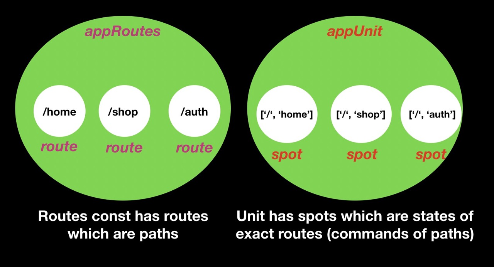

# Units

Unit is a modular entity which contains the stateful module routes



There are two create functions:

* **createRoot** - creates a root unit.
* **createFeature** - creates a lazy unit called **connector** which connects one by one to parent unit.

Each creator takes the `routes: Routes` and an object of options

* key - accepts string or symbol
* routeName - accepts object with optional custom values root: "NAME OF '' PATH", wildcard: "NAME OF \*\* PATH"}
* nearby - accepts _lazy unit_ which produces **feature creator**. Nearby option should be used only when one or more features are eager modules which connect to some module and those eager module has its own paths.

**Root creator** _****_invokes only once to initialize the _hub_ of application. It takes initial \(app\) routes and options. 

In turn the **feature creator** is responsible for relations between parent and child units.

As mentioned above, creator functions have the second argument of options which is object of:

* **key** - unit identifier and accepts string or symbol
* **routeName** - accepts an object with optional custom names for wildcard \('\*\*'\) and root \(''\) paths
* **nearby** - accepts _lazy units_ which are outputs of **feature creator**. Nearby option should be used when one or more connected features are eager modules with their own routes files.

### Creating Root

```typescript
createRoot<AppNotes, AppChildNotes>(
  appRoutes, 
  {
      /**
      * key prop is familiar for all of us
      * it provides a possibility to identify the unit
      */
      key: APP_NOTES_KEY,
      /**
      * you may be confused about routeName property of options
      * by default route path '' transforms into property 'root'
      * and '**' transforms into property 'wildcard'
      */
      routeName: { root: 'home', wildcard: 'notFound' },
      /**
      * nearby prop are modules which were imported into the module
      * but they have their own routes files without direct routes relations
      * with module in which they were imported
      */
      nearby: {
          location: locationConnector
      }
  }
);
```

### Creating Feature

```typescript
export const locationConnector: Connector<AboutNotes, AboutChildNotes> = 
    createFeature<LocationNotes>(locationRoutes, { 
        key: LOCATION_NOTES_KEY,
        nearby: {
            map: mapConnector
        }
    } 
);
```

